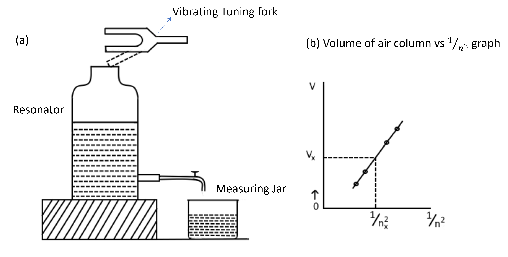

### Theory

A resonator is essentially a gas column having a natural frequency of vibration. It resounds energetically to tuning forks of appropriate frequencies. Helmholtz resonator has a neck at one end to receive the exciting waves. The air in the neck acts like a piston, alternatively compressing and rarefying air contained in the resonator when a tuning fork is sounded above the neck. Thus, the periodic oscillations of the air molecules are set up within the resonator.

If n is the frequency of the tuning fork and V is the resonating air volume, then for a particular resonator,

n2V = constant

A graph plotted between Volume V and 1/n2 should be a straight line. The frequency of any tuning fork can be found by experimentally determining the resonating air volume for the tuning fork.

